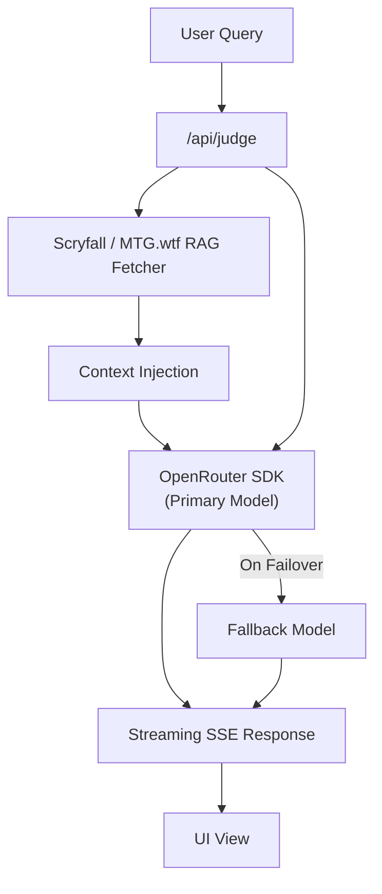

# MTG Life Counter

**A tabletop-first Magic: The Gathering companion.**  
_Life tracking at dice speed — plus an AI rules judge that settles disputes
without anyone leaving the table._

[Live Demo](https://your-demo-link.com) • [Features](#key-features) •
[Architecture](#architecture--agent-system)

 

|                                                                                                                                                                                                                               Core Framework                                                                                                                                                                                                                               |                                                                                    AI & Data Engine                                                                                    |                                                                                                                                                    Tooling & Deploy                                                                                                                                                     |
| :------------------------------------------------------------------------------------------------------------------------------------------------------------------------------------------------------------------------------------------------------------------------------------------------------------------------------------------------------------------------------------------------------------------------------------------------------------------------: | :------------------------------------------------------------------------------------------------------------------------------------------------------------------------------------: | :---------------------------------------------------------------------------------------------------------------------------------------------------------------------------------------------------------------------------------------------------------------------------------------------------------------------: |
|     |   |    |

---

## Overview

Magic: The Gathering is played on kitchen tables, game stores, and tournament
halls. Every game needs a fast, reliable way to track life totals. Existing
applications compromise either on interface clarity, offline reliability, or
in-game utility.

### Market Comparison

| Application                  | Strengths                                  | Limitations                                                           |
| :--------------------------- | :----------------------------------------- | :-------------------------------------------------------------------- |
| **MTG Companion** (Official) | Tournament pairing, match structure        | Account/event-centric. Overkill for casual play. No rules assistance. |
| **MTG Familiar**             | Comprehensive rules, card DB, prices       | Cluttered UI. Life tracking is secondary. Ads and legacy layout.      |
| **Dragon Shield Counter**    | Simple, clean interface                    | Basic tap counter. Lacks Commander damage depth or multi-trackers.    |
| **MTG Life Counter**         | **Gesture-first UI, AI Judge, zero setup** | _Designed specifically for active gameplay loops._                    |

---

## Core Differentiators

> **Typographic Brutalism for Tabletop Readability**  
> Built with Archivo Black 900 numerals and custom WUBRG color identities.
> Features no window chrome or screen noise — rendering life totals clearly
> across dark rooms and wide angles.

> **Ground-Truth AI Rules Judge**  
> An inline LLM judge powered by a RAG pipeline over the official Comprehensive
> Rules and Scryfall card data. Mid-game disputes are answered in seconds with
> exact rule citations (`CR 702.12a`).

- **Gesture-First Control:** Tap $\pm 1$, hold $\pm 10$, swipe for commander
  damage and counter overlays. Faster than physical dice.
- **Offline-First PWA Architecture:** Fully functional game state tracking
  without network access. Zero ads, zero tracking, no user accounts.
- **Multi-Player Adaptive Layout:** Supports up to 6 players with automatic UI
  rotation ($180^\circ / 90^\circ$) so every player reads their controls
  natively.

---

## Key Features

### Game Tracking

- **Adaptive Layouts:** 2–6 player configurations supporting portrait/landscape
  orientations with auto-rotated player zones.
- **Trackers & Counters:** Life total, Commander damage (with 21-damage
  lethality engine), Poison (10-lethal rule), Energy, Experience, Time, and
  custom counters.
- **WUBRG Identity:** Per-player color identities with custom dynamic
  multi-color gradients.
- **Persistence:** Instant resume via IndexedDB state persistence.

### AI Rules Engine

- **Streaming Responses:** Server-Sent Events (SSE) with incremental text
  rendering and low latency fallback routing.
- **RAG Pipeline:** Real-time retrieval against official Comprehensive Rules
  (`mtg.wtf`) and Scryfall API data with cited answers.
- **Bilingual Support:** Native English and Spanish processing (via dynamic MTG
  translation dictionaries).
- **Graceful Degradation:** Card lookup network failures never block core rule
  answers; offline mode retains full life-counter capabilities.

---

### Roadmap

| Feature                                                            | Status  |
| ------------------------------------------------------------------ | ------- |
| Semantic retrieval with embeddings (`OPEN_ROUTER_EMBEDDING_MODEL`) | Phase 2 |
| AI Judge voice input                                               | Phase 2 |
| Card art backgrounds from Scryfall                                 | Phase 2 |
| Offline AI rules engine — full rules corpus in the service worker  | Phase 3 |

---

## Architecture & Agent System

This repository was constructed using a **contract-driven multi-agent
development pipeline**. Every component, interaction, and state change adheres
strictly to `DESIGN.md` and `SPEC.md`.

### Agent Roles

| Agent                | Responsibility                                                         |
| -------------------- | ---------------------------------------------------------------------- |
| **Orchestrator**     | Task planning, design contract enforcement, quality gates              |
| **Frontend Dev**     | React 19 components, Tailwind CSS v4, gesture handlers, canvas/layouts |
| **AI Engineer**      | OpenRouter SDK, RAG indexing, SSE streaming, error boundary handlers   |
| **Code Review**      | Static audit against `DESIGN.md` and `SPEC.md` binding contracts       |
| **Playwright Suite** | E2E scenarios, test generation, and self-healing test scripts          |

---
